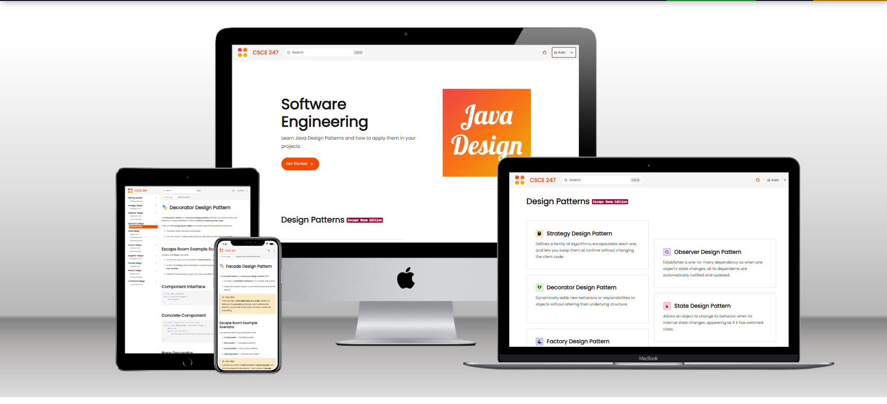

# CSCE247 Website

A Technical Documentation Website that teaches the Java Design Patterns learned in CSCE247 Software Engineering at the University of South Carolina.

[](https://starlight.astro.build)

```
npm create astro@latest -- --template starlight
```




## Details

- [Astro](https://astro.build/) - web framework

- Fonts through [Fontsource](https://fontsource.org/):
  - [Poppins](https://fontsource.org/fonts/poppins) - sans font
  - [Fira Code](https://fontsource.org/fonts/fira-code) - code font

- [Favicon.io](https://favicon.io/) - favicon generator

- [Inkscape](https://inkscape.org/) - graphic design

- [Starlight](https://starlight.astro.build/) - astro technical documentation template

- [TailwindCSS](https://tailwindcss.com/) - css framework

- [TechSini](https://techsini.com/) - website mockup

- [TinyPNG](https://tinypng.com/) - image compression